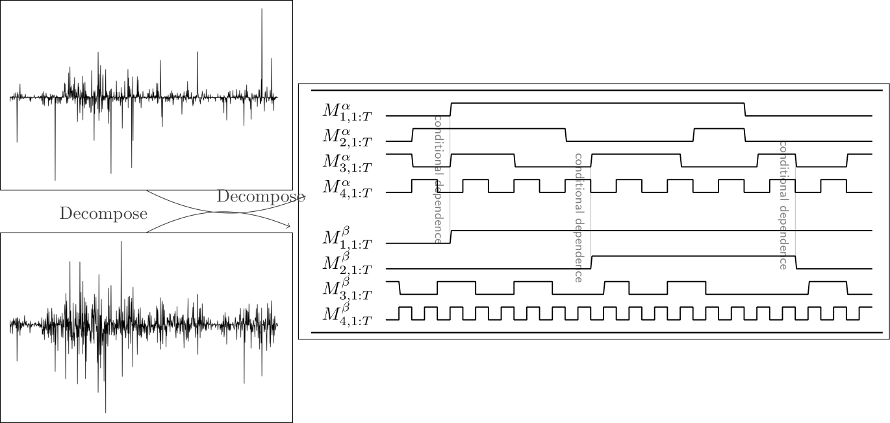

# BEST_proj

## Intuition of our model

This image explains the structure of our model.

Imagine it as probabilistic equivalent of Fourier decomposition where decomposed Markow Switching processes are conditionally dependent across series.

What does this structure mean? Imagine these Markov Switching Processes with varing degree of switching probability as capturing short to long term perception of regimes in the market. 

Then, finding a dependence between short to long-term switches across series can inform how robust each series are to these shocks by observing which layer of regime has switched.

This model of market shocks (essentially errors in the regression term) combined with more long-term forecast-oritented models such as DLMs (which is the regression part) can make more conservative long-term forcasts of the future states and observations.

## mIBP: Scala-Spark code for sampling from Markov Indian Buffet Process (not useful after all so no plans to update soon)

## MSM_exact: MCMC for posterior sampling from Bayesian Bivariate MSM written in Scala with Some Spark parts (currently testing with toy data)
